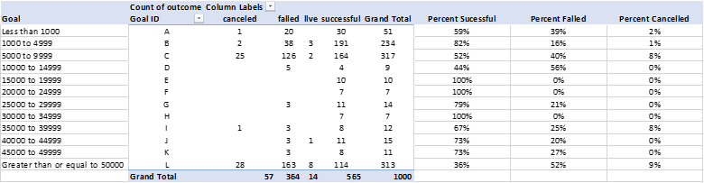

# Crowdfunding Project Financial Analysis

> Report generated by Alberto Ponce

### Preliminary conclusions 

*what are three conclusions we can draw about crowdfunding campaigns?*

Given the provided data, there are a few conclusions that one can draw from this funding platform. 

1. Theatre is the most applied for project category, but is by far the most successful - if one measures success as the times applied against the crossing "funding"  goal.  

   > ​	Theatre has a 54% success rate within the last 10 years. In contrast, technology and photography have an above average success rate (over 60%) and journalism boasts a 100% success rate (with only 4 entries to the crowdfunding platform)

   | Parent Category | successful | failed | canceled | live  |
   | --------------- | ---------- | ------ | -------- | ----- |
   | film & video    | 57.30%     | 33.71% | 6.18%    | 2.81% |
   | food            | 47.83%     | 43.48% | 8.70%    | 0.00% |
   | games           | 43.75%     | 47.92% | 2.08%    | 6.25% |
   | journalism      | 100.00%    | 0.00%  | 0.00%    | 0.00% |
   | music           | 56.57%     | 37.71% | 5.71%    | 0.00% |
   | photography     | 61.90%     | 26.19% | 9.52%    | 2.38% |
   | publishing      | 59.70%     | 35.82% | 2.99%    | 1.49% |
   | technology      | 66.67%     | 29.17% | 2.08%    | 2.08% |
   | theater         | 54.36%     | 38.37% | 6.69%    | 0.58% |
   | Grand Total     | 56.50%     | 36.40% | 5.70%    | 1.40% |

2.  Over the 10-year period, the trend on getting a project funding mostly project downwards over the entire year, indicating that it will be hard to get funding. This could be interpreted a few ways, ie. there is strong competition or the user base taking part of the crowdfunding is limited and has particular preferences. However, there is on average and uptick of successful projects during the months of June and July. This could be the influence of summer, where school is out and families are consuming content at a faster rate, leading to crowdfunding platforms like this to have a surge in successful applications.

3.  In terms of the platform's documented publicity of projects, it can be observed that this platform's staff and algorithm spotlight feature heavily favors theatre, film and music projects.

   

## Limitations of the dataset

*What are some limitations of this dataset?*

#### Undefined Market Regions

At first glance some of the limitations of this dataset have to do with the project origins. Much of the projects that have applied to the crowdfunding platform have been from the United States. However, 20% of the successful projects come from outside the US. 

A suggestion would be to classify the US by smaller regions to match the relative size and total market audience of the other countries. 

> For example, the US could be further subdivided into regions such as
>
> - Midwest
> - East Coast
> - West Coast
> - Gulf Coast
>
> And the European Regions could be further grouped either by:
>
> - currency
> - language (Slavic vs Romanized content)

These differentiations could help the crowdfunding platform better understand their creator market and the audience market. Profiles and packages could be created, tailored for each region as an incentive for creatives choosing to use this crowdfunding platform over the competitors. It would also manage any social media queries and SEO.

#### Balancing the platform's "investment" portfolio

*What are some other possible tables and/or graphs that we could create, and what additional value would they provide?*

An additional chart and calculated field could be to tie the funding to a new category - **implementation timing**. This  field would indicate whether the project would have to be consumed in a short term (ie., food or other perishables, limited edition projects), seasonal (for a few months at a time, for the duration of a set season or tour), or long term (distributed on channels to be consumed at the audience's leisure):

This crowdfunding platform has a heavy focus towards supporting seasonal projects such as theatre, film & video and music. These project categories carry the characteristic of  not necessarily having a shelf life, but rather a time in place that audiences have a demand to consume such content. 72% of funding tracked by the crowdfunding platform, representing a little over $30 million showcases that the users on participating on the platform help fund seasonal projects more than others. 

> There could be a scenario that a creator, or rather a series of creators would mass exit the platform due to the heavily weighted preference towards seasonal content. This would not only pigeon-hole the platform, but greatly reduce the appeal to the general audience as too "specialized" or "biased". It might be a goal-oriented decision to rebalance the portfolio by incentivizing project types across a  "implementation timeline". Being transparent to creators will no doubt increase the number of applications as well as the hype for the average donor/user/customer.

### Bonus Module

In an effort to streamline the data, an auxiliary table was created with the goal category label. 

| **Goal**                        | **Goal  Cat** | **Total  Projects** |
| ------------------------------- | ------------- | ------------------- |
| Less than 1000                  | A             | 51                  |
| 1000 to 4999                    | B             | 234                 |
| 5000 to 9999                    | C             | 317                 |
| 10000 to 14999                  | D             | 9                   |
| 15000 to 19999                  | E             | 10                  |
| 20000 to 24999                  | F             | 7                   |
| 25000 to 29999                  | G             | 14                  |
| 30000 to 34999                  | H             | 7                   |
| 35000 to 39999                  | I             | 12                  |
| 40000 to 44999                  | J             | 15                  |
| 45000 to 49999                  | K             | 11                  |
| Greater than or equal  to 50000 | L             | 313                 |
|                                 |               | 1000                |

This made counting the results a part of the pivot table, instead of inputting the formula individually across a disjointed cell. 

### Bonus Statistical Analysis

#  

| **Failed Statistics** | **Successful Statistics** | **Statistical Analysis  Results**               |
| --------------------- | ------------------------- | ----------------------------------------------- |
| 586                   | 851                       | The mean number of backers                      |
| 115                   | 201                       | The median number of backers                    |
| -                     | 16                        | The minimum number of backers                   |
| 6,080                 | 7,295                     | The maximum number of backers                   |
| 921,575               | 1,603,374                 | The variance of the number of backers           |
| 960                   | 1,266                     | The standard deviation of the number of backers |

Between mean and median, it still seems that the successful entries have a ratio of 2 to 1 failed entry. In my opinion you could use both or either to represent this dataset depending on the scale of the conversation (tens or hundreds). 

In terms of the upper quartile projects as it relates to number of backers, there is between 1.3-1.7 times the number of backers in successful campaigns than in failed campaigns. This is in comparison to the median/mean, middle quartiles, where there is not much significant difference. Given the numbers of this crowdfunding platform, one could say that once passing the 1,000-backer count there is less than 50% chance the project will get funded.

